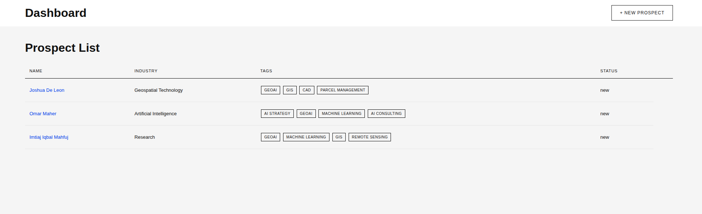
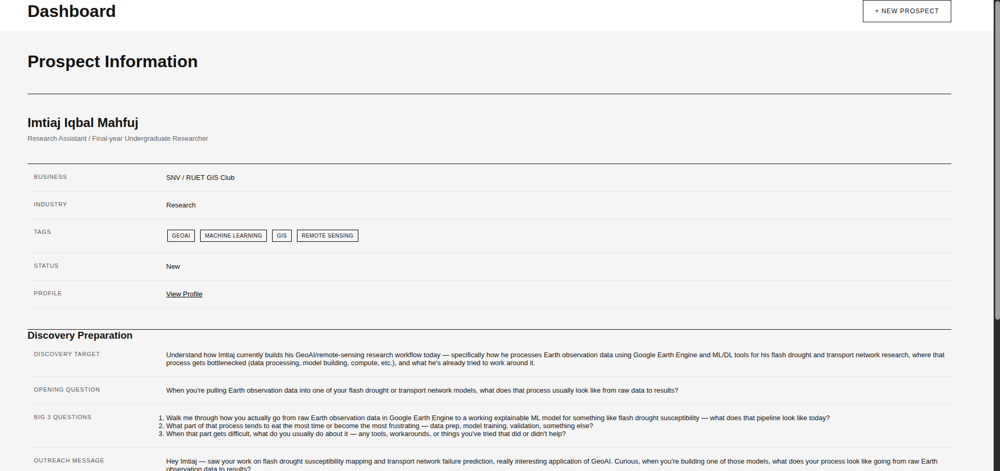
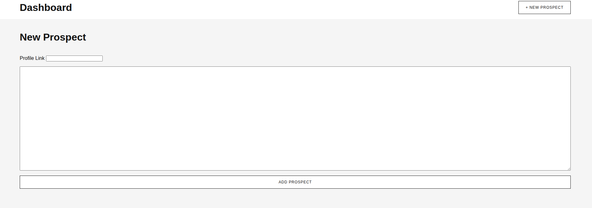
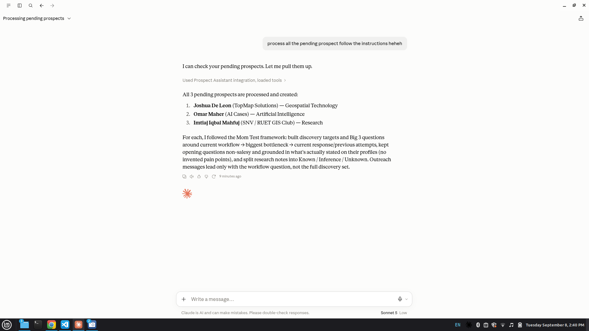

# Industry Prospect

Industry Prospect is a lightweight **prospect intelligence and outreach tool** for turning raw prospect information into structured data, better discovery questions, and lessons learned from real conversations.

The core idea is simple:

> **Prospect → Analyze → Store → Outreach → Learn → Improve**

Instead of treating prospecting as a collection of disconnected notes, Industry Prospect creates a small feedback loop where every conversation can improve future prospecting.






## What It Does

Start with basic information about a prospect, such as their profile link, role, company, and any available context.

Industry Prospect uses AI to enrich that information and prepare it for prospecting.

It helps answer:

* Who is this prospect?
* What company and industry are they in?
* What might their current workflow look like?
* What problems might be worth exploring?
* What questions should I ask?
* What can I learn from the conversation afterward?

The system is designed around **customer discovery rather than hard selling**.

Its outreach and questioning approach is influenced by principles from **The Mom Test** and **Never Split the Difference**, with an emphasis on asking practical, open-ended questions and uncovering the prospect's actual situation.

---

## Core Workflow

```text
Paste
  ↓
Analyze
  ↓
Store
  ↓
Outreach
  ↓
Conversation
  ↓
Learn
  ↓
Better Prospecting
```

### 1. Insert

Paste the available prospect information into the application.

This can include:

* LinkedIn/profile URL
* Name
* Job title
* Company
* Existing notes
* Other relevant context

AI analyzes the information and extracts the important structured data.

For example:

* Company
* Industry
* Notes
* Prospect status
* Relevant context for discovery

New prospects are automatically assigned the `NEW` status.

---

### 2. Prospect Bank

The Prospect Bank is the central place for managing prospects.

It allows you to:

* View prospects
* Filter prospects by industry
* Track prospect status
* Record conversation outcomes
* Capture lessons learned
* Review previous prospecting activity

The goal is to keep prospect intelligence organized without turning the application into a full CRM.

---

### 3. Outreach

Industry Prospect prepares outreach around **three core discovery questions**:

1. **How are you doing this today?**
2. **What is difficult about the current process?**
3. **What happens if the problem is not solved?**

These questions are designed to move the conversation away from assumptions and toward the prospect's actual experience.

The generated outreach should feel like a genuine conversation starter rather than a sales pitch.

The system uses the prospect's available context to make these questions specific and relevant instead of blindly using the same message for everyone.

---

### 4. Learn

After a conversation, important information should not disappear into a chat history.

Industry Prospect captures:

* What the prospect said
* How they currently solve the problem
* What is difficult about their current process
* What consequences they experience
* Whether the problem appears significant
* What worked or did not work during outreach
* What should change in future prospecting

These observations become **lessons learned** that can improve future prospecting.

---

## UI

The application revolves around two main areas.

### Insert

A simple interface for entering raw prospect information.

The user provides the available information and lets AI structure and enrich it.

### Dashboard

The dashboard provides an overview of the prospect bank.

It can be used to:

* Review prospects
* Filter by industry
* Track outcomes
* Review successful and unsuccessful conversations
* Identify lessons learned

---

## Tech Stack

* **Django** — Backend, application framework, and data models
* **PostgreSQL / Neon / sqlite**  — Persistent database
* **MCP** — AI interaction and tool access
* **Python** — Application language
* **uv** — Python dependency and project management
* **djLint** — Django template formatting and linting

---

## Documentation

For setup instructions and technical details, see:

* **[Installation & Getting Started](docs/installation.md)** — Local setup, dependencies, environment variables, database, Django, MCP, Celery, and development commands.
* **[Architecture](docs/architecture.md)** — Application structure, services, models, MCP integration, Celery, AI workflow, and architectural principles.

---

## Goal

Industry Prospect is intentionally **not a full CRM**.

The goal is to build a small, focused feedback loop around prospecting.

Instead of:

```text
Find prospect
    ↓
Send message
    ↓
Forget
```

the system aims for:

```text
Find prospect
    ↓
Understand context
    ↓
Ask better questions
    ↓
Have conversation
    ↓
Capture what happened
    ↓
Learn
    ↓
Improve next outreach
```

### The Core Idea

> **Prospect → Conversation → Lesson → Better Prospecting**

### Future Plans

1. Move it to more cloud AI
2. Deploy it so that i can just use my phone in the prospect search 

